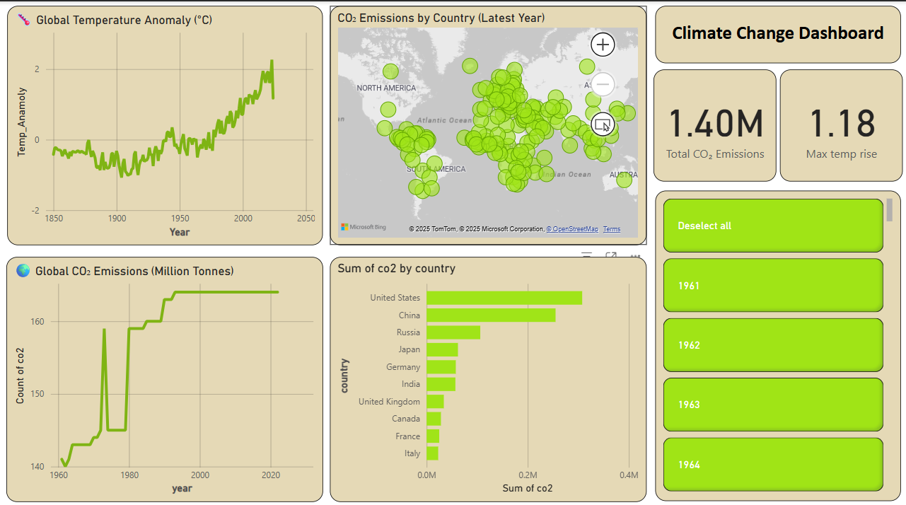

# 🌍 Climate Change Dashboard – Global Emissions & Temperature Trends (1960–Present)

## 📊 Overview

This interactive Power BI dashboard provides a compelling visual analysis of climate change indicators from 1960 to the present. It focuses on two major metrics:

- **CO₂ Emissions by Country**
- **Global Temperature Anomalies**

The goal is to help users intuitively understand climate patterns, identify top emitters, and observe how emissions relate to rising global temperatures.

---

## 🧠 Key Insights

- 🌡️ **Global Warming Trend:** Track how average global temperatures have shifted over decades.
- 🏭 **Top Emitters:** Identify countries contributing most to CO₂ emissions.
- 🕹️ **Time-Based Exploration:** Analyze changes year by year with interactive slicers and sliders.
- 🎯 **ESG-Relevant:** Ideal for sustainability-focused data analysis roles or presentations.

---

## 📌 Features

✅ CO₂ Emissions World Map  
✅ Vertical + Timeline Slicers  
✅ Emission Category Segmentation (Very Low → Very High)  
✅ Dynamic Tooltips with Year, Country, and CO₂ Values  
✅ Custom Color Scale (Low → High Impact)

---

## 🛠️ How It's Useful

This dashboard can help:

- **Data Analysts** present environmental trends clearly.
- **Policymakers & NGOs** make informed climate decisions.
- **Sustainability Teams** monitor ESG goals and emissions over time.
- **Job Seekers** showcase data storytelling and Power BI skills in the Climate domain.

---

## 🧮 Dataset

The data includes:
- **CO₂ Emissions** (Million Tonnes) by country and year
- **Temperature Anomaly** data per year

> Source: [Global Carbon Atlas](https://globalcarbonatlas.org/) & [NASA Climate Data](https://data.giss.nasa.gov/gistemp/)

---

## 📁 Files Included

